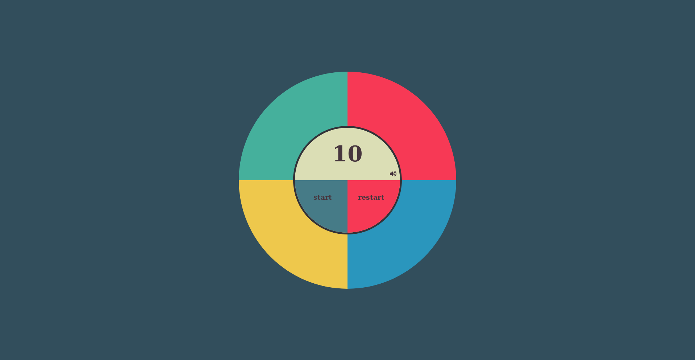

# Simon Says

This version of Simon Says in developed in Javascript and playable in the browser.

# What is Simon Says?

Simon Says is a game of memory and pattern recognition. The game starts by playing a random colour
and sound, and then waits for the player to copy the same pattern back, after each successful
repeat of the patten the game adds a new colour and sound to the sequence untill the player fails
to successfully repeat the patten back.
